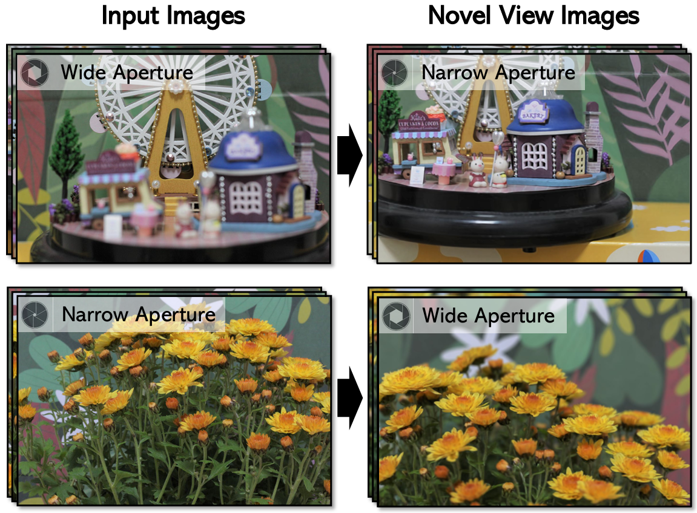
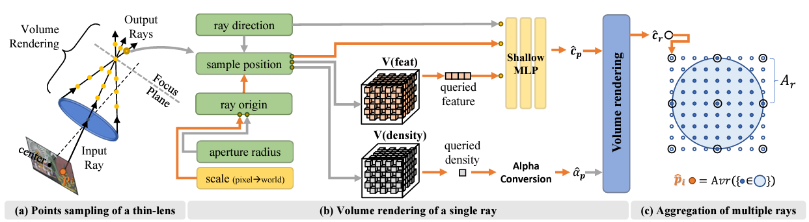

# LensNeRF: Rethinking Volume Rendering Based on Thin-Lens Camera Model
[Min-Jung Kim](emjay73.github.io), [Gyojung Gu](https://github.com/koo616/koo616.github.io), [Jaegul Choo](https://sites.google.com/site/jaegulchoo/) <br />

[[`Paper`](https://openaccess.thecvf.com/content/WACV2024/html/Kim_LensNeRF_Rethinking_Volume_Rendering_Based_on_Thin-Lens_Camera_Model_WACV_2024_paper.html)]
[[`Code`](https://github.com/emjay73/LensNeRF)]
[[`Data`](https://huggingface.co/datasets/emjay73/lensnerf_dataset)]

## Overview
<p align="center">

</p>
<p align="center">

</p>

## Environment Setup
1. Create conda env
```
conda create -n lens python=3.10
conda activate lens
```

2. Install pytorch and torch scatter.\
Be aware that pytorch version should be carfully selected based on YOUR environment.\
The following command lines show how our environment was set up for reference.
```
conda install pytorch==1.13.1 torchvision==0.14.1 torchaudio==0.13.1 pytorch-cuda=11.6 -c pytorch -c nvidia -y
```

3. Install Dependencies
```
pip install -r requirements.txt
```

4. make cuda available (Our code is tested with CUDA 11.4)
```
export CUDA_HOME=/apps/cuda/11.4
export CUDA_NVCC_EXECUTABLE=$CUDA_HOME/bin/nvcc
export CUDNN_LIB_DIR=$CUDA_HOME/lib64
export CUDNN_INCLUDE_DIR=$CUDA_HOME/include/
export CUDNN_LIBRARY=$CUDA_HOME/lib64
export PATH=$CUDA_HOME/bin:$PATH
export LD_LIBRARY_PATH=$CUDA_HOME/lib64:$LD_LIBRARY_PATH
export CMAKE_PREFIX_PATH=${CONDA_PREFIX:-"$(dirname $(which conda))/../"}
```

## Prepare the Dataset
```
cd LensNeRF
mkdir data
cd data
git lfs install
git clone https://huggingface.co/datasets/emjay73/lensnerf_dataset
cd lensnerf_dataset
tar -xvf lensnerf_dataset.tar.gz
```


## Some noticeable Errors 
1)Index error 
```
in _get_cuda_arch_flags
    arch_list[-1] += '+PTX'
IndexError: list index out of range
```

following might help
```
# https://github.com/pytorch/extension-cpp/issues/71
export TORCH_CUDA_ARCH_LIST="3.5;5.0;6.0;6.1;7.0;7.5;8.0;8.6+PTX"
```

## How to Run
Our work is trained on A100 or V100 GPU.

### Activate Env
```
mkdir logs
mkdir build
export TORCH_EXTENSIONS_DIR=build/torch_extensions
export PYTORCH_CUDA_ALLOC_CONF=max_split_size_mb:512
conda activate lens
```
### Train
```
# sh scripts_kisti/train_ours.sh [DATANAME] [MODE]
sh scripts_kisti/train_ours.sh AmusementPark train
```

Possible dataset names are as follows.
```
AmusementPark
AppleMint
Bear
BoyAndGirl
Chrysanthemum
Gink
Sheep
Snowman
Xmas
```
### Render
```
# sh scripts_kisti/train_ours.sh [DATANAME] [MODE]
sh scripts_kisti/train_ours.sh AmusementPark render
```

## Thanks Note
Our code is based on the DirectVoxGO implementation.\
Huge thanks for the amazing work by the authors of DVGO!\
\
Direct Voxel Grid Optimization (CVPR2022 Oral, [project page](https://sunset1995.github.io/dvgo/), [DVGO paper](https://arxiv.org/abs/2111.11215), [DVGO v2 paper](https://arxiv.org/abs/2206.05085)).
